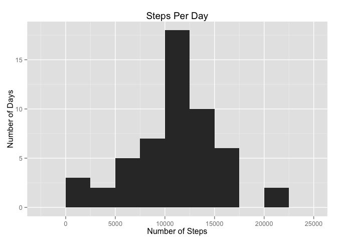
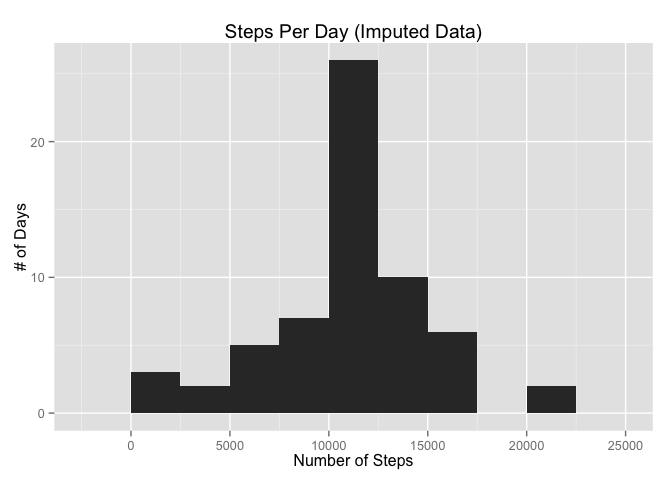

# Reproducible Research: Peer Assessment 1


## Loading and preprocessing the data


```r
activity_data=read.csv(unzip("activity.zip"))
activity_no_na = activity_data[!is.na(activity_data$steps),]
```

## What is mean total number of steps taken per day?

```r
library(plyr)
library(ggplot2)
activity_day = ddply(activity_no_na, .(date), summarize, StepsByDay=sum(steps))
meanActivityByDay = round(mean(activity_day$StepsByDay))
medianActivityByDay = round(median(activity_day$StepsByDay))

ggplot(activity_day, 
         aes(x = StepsByDay
         )) +
          geom_bar(stat = "bin", binwidth = 2500) + 
          ggtitle("Steps Per Day") + 
          labs(x="Number of Steps") + 
          labs(y="Number of Days")
```

<!-- -->

#### Mean number of steps per day : 1.0766\times 10^{4}
#### Median number of steps per day: 1.0765\times 10^{4}

## What is the average daily activity pattern?

```r
activity_interval = ddply(activity_no_na, .(interval), summarize, StepsByInterval=mean(steps))
ggplot(activity_interval, 
         aes(x = interval, 
             y = StepsByInterval
        )) +
          geom_line() + 
          ggtitle("Average Steps Per Interval") + 
          labs(x="Interval") + 
          labs(y="Steps")
```

<!-- -->

```r
max_activity_steps = max(activity_interval$StepsByInterval)
max_activity_interval = activity_interval[activity_interval$StepsByInterval == max_activity_steps, "interval"]
```
#### Interval with highest average steps: 835  with 206.1698113 steps.


## Imputing missing values using average of interval value

```r
activity_data_impute = activity_data
activity_data_na_map = is.na(activity_data_impute)
activity_data_na_count = sum(activity_data_na_map)

for (i in 1:length(activity_data_impute$steps)) {
    if (is.na(activity_data_impute$steps[i])) {
      activity_data_impute$steps[i] =  
          activity_interval[activity_interval$interval == activity_data[i,"interval"],"StepsByInterval"] 
    }
}

activity_day_impute = ddply(activity_data_impute, .(date), summarize, StepsByDay=sum(steps))
meanActivityByDay_impute = round(mean(activity_day_impute$StepsByDay))
medianActivityByDay_impute = round(median(activity_day_impute$StepsByDay))

diffmean = meanActivityByDay_impute - meanActivityByDay
diffmedian = medianActivityByDay_impute - medianActivityByDay

ggplot(activity_day_impute, 
         aes(x = StepsByDay
         )) +
          geom_bar(stat = "bin", binwidth = 2500, location=position_dodge()) + 
          ggtitle("Steps Per Day (Imputed Data)") + 
          labs(x="Number of Steps") + 
          labs(y="# of Days")
```

<!-- -->

#### Mean number of steps per day (Imputed): 1.0766\times 10^{4}
#### Median number of steps per day (Imputed): 1.0766\times 10^{4}

#### Difference between mean imputed and non-imputed data: 0
#### Difference between median imputed and non-imputed data: 1

#### Based on the difference in mean and median there is no significant difference (in this case) between using Imputed data and data with the NAs removed.  The non-imputed data is just as valid


## Are there differences in activity patterns between weekdays and weekends?

```r
activity_data_impute$PartOfWeek = 
    ifelse(weekdays(as.Date(activity_data_impute$date)) %in% c("Saturday","Sunday"),"weekend","weekday")

activity_weekend_impute = ddply(activity_data_impute, .(interval,PartOfWeek), summarize, StepsByInterval=mean(steps))
ggplot(activity_weekend_impute, 
         aes(x = interval, 
             y = StepsByInterval,
             col = PartOfWeek
        )) +
          facet_wrap(~PartOfWeek, nrow = 2) +
          geom_line() + 
          ggtitle("Daily Steps Per Part of Week (Imputed Data)") + 
          labs(x="Interval") + 
          labs(y="Steps")
```

<!-- -->

#### Based on the graphs we see that there are more steps earlier during the weekdays, and a higher amount of steps later in the day on the weekends.  
